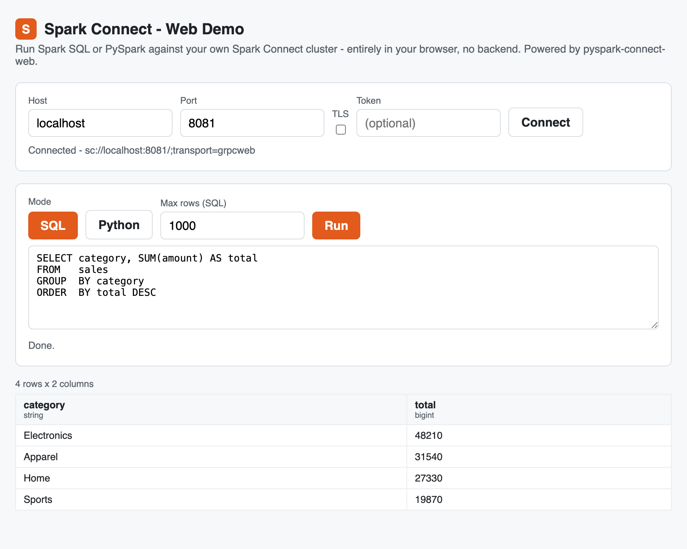

<!-- SPDX-License-Identifier: Apache-2.0 -->

# Spark Connect for Excel

[](https://github.com/HyukjinKwon/spark-connect-excel/actions/workflows/ci.yml)
[](https://github.com/HyukjinKwon/spark-connect-excel/actions/workflows/e2e.yml)
[](LICENSE)
[](https://hyukjinkwon.github.io/spark-connect-excel/)

**Power Query, but the engine is your Spark cluster.**

An Excel add-in that runs a Spark SQL query against your own
[Spark Connect](https://spark.apache.org/docs/latest/spark-connect-overview.html)
cluster, lands the result directly in a worksheet range, refreshes it, and
charts it - with **no backend server of its own**. The query client runs
entirely in-browser via
[pyspark-connect-web](https://github.com/HyukjinKwon/pyspark-client-wasm)
(real PySpark, in Pyodide). See the
[full documentation](https://hyukjinkwon.github.io/spark-connect-excel/).

<p align="center">
  
  <br/>
  <em>The web demo - Spark SQL with syntax highlighting.</em>
</p>

## Features

- **SQL in Excel** - write Spark SQL in the task pane; results land as typed cells.
- **Typed ranges** - Spark's schema drives Excel number formats (dates, decimals, integers).
- **Truncation guard** - row cap (default 10k) with a visual banner when the result is clipped.
- **Refresh** - rebind the query to its range; one click updates stale data.
- **Native charts** - auto-inferred chart type (line for time-series, column for categories, scatter for numeric pairs).
- **No backend** - compute runs on your Spark cluster; the add-in is static HTML/JS.
- **Secure token handling** - bearer tokens never touch a cell or the workbook file.
- **Zero-install web demo** - a standalone page (`/demo`) that runs **SQL _or_ PySpark**
  in the browser, no Excel required - the easiest way to try it.

## Quickstart

### Prerequisites

- Node 20.
- A Chromium-based Excel host: Excel on Windows / Microsoft 365, or Excel on the web in Edge or Chrome.
- A running Spark Connect server (see below).

### Start a Spark Connect server

The demo and the add-in both talk to a Spark Connect server through an Envoy
grpc-web proxy. Start one first, either way:

```bash
# Docker - full stack (Spark Connect + Envoy + a static host) in one command:
docker compose -f deploy/compose.yaml up
```

No Docker? Run a server locally with PySpark (Java 17) and put Envoy in front of
it - see the
[installation guide](https://hyukjinkwon.github.io/spark-connect-excel/installation/).

### Try it without Excel - the web demo

A standalone page, no Excel and no sideload. One command clones, installs, and
serves the add-in:

```bash
curl -fsSL https://raw.githubusercontent.com/HyukjinKwon/spark-connect-excel/main/scripts/quickstart.sh | bash
```

Open `https://localhost:3000/demo/demo.html`, point it at your Spark Connect
server, and run a query. See the
[usage guide](https://hyukjinkwon.github.io/spark-connect-excel/usage/).

### Try with Excel on the web (sideload)

With a Spark Connect server running, start the add-in:

```bash
curl -fsSL https://raw.githubusercontent.com/HyukjinKwon/spark-connect-excel/main/scripts/quickstart.sh | bash
```

Then in Excel on the web (Edge/Chrome): **Insert -> Add-ins -> Upload My Add-in
-> choose `manifest.xml`**. The **Spark SQL** button appears on the Home ribbon.

### Try with Excel on Windows / Mac desktop (sideloads)

With a Spark Connect server running:

```bash
curl -fsSL https://raw.githubusercontent.com/HyukjinKwon/spark-connect-excel/main/scripts/quickstart.sh | bash -s -- desktop
```

This serves the add-in and opens Excel with it sideloaded. Full guides are on the
[documentation site](https://hyukjinkwon.github.io/spark-connect-excel/).

## Compatibility

| Component | Supported |
|-----------|-----------|
| Excel | 2019 / Microsoft 365 - Windows, Mac, Excel on the web |
| Excel API requirement | ExcelApi 1.12, DialogApi 1.2 |
| Spark | 4.x (Spark Connect; `apache/spark:4.0.0` in the deploy stack) |
| PySpark | `>=4.0,<4.2` (enforced by `pcw.install()`) |
| Browser engine | Chromium-based (WebView2, Edge, Chrome) - `COEP: credentialless` is Chromium-only |
| Node | 20 LTS |
| Python | 3.11+ (for local dev/tests; Pyodide 0.28+ in the browser) |
