<!-- SPDX-License-Identifier: Apache-2.0 -->

# Spark Connect for Excel

[](https://github.com/HyukjinKwon/spark-connect-excel/actions/workflows/ci.yml)
[](https://github.com/HyukjinKwon/spark-connect-excel/actions/workflows/e2e.yml)
[](LICENSE)

**Power Query, but the engine is your Spark cluster.**

<p align="center">
  
  <br/>
  <em>Concept animation (mockup). Type Spark SQL → Run → rows land in the grid → chart inserted.</em>
</p>

An Excel add-in that runs a Spark SQL query against your own
[Spark Connect](https://spark.apache.org/docs/latest/spark-connect-overview.html)
cluster, lands the result directly in a worksheet range, refreshes it, and
charts it — with **no backend server of its own**. The query client runs
entirely in-browser via
[pyspark-connect-web](https://github.com/HyukjinKwon/pyspark-client-wasm)
(real PySpark, in Pyodide).

---

## Features

- **SQL in Excel** — write Spark SQL in the task pane; results land as typed cells.
- **Typed ranges** — Spark's schema drives Excel number formats (dates, decimals, integers).
- **Truncation guard** — row cap (default 10k) with a visual banner when the result is clipped.
- **Refresh** — rebind the query to its range; one click updates stale data.
- **Native charts** — auto-inferred chart type (line for time-series, column for categories, scatter for numeric pairs).
- **No backend** — compute runs on your Spark cluster; the add-in is static HTML/JS.
- **Secure token handling** — bearer tokens never touch a cell or the workbook file.

---

## Architecture

```
  Task Pane (Office.js UI)
       │  SparkBridgeClient + postMessage
       ▼
  COI Dialog Window  ← served with COOP: same-origin + COEP: credentialless
  (crossOriginIsolated === true → SharedArrayBuffer OK)
       │  Pyodide + pyspark-connect-web (real PySpark Connect client)
       │  grpc-web over fetch
       ▼
  Envoy grpc-web proxy  →  Spark Connect server (Spark 4.x)

  pandas result → SparkResult JSON → Office.js range + chart
```

Full details: [docs/architecture.md](docs/architecture.md)

The critical design choice: Pyodide and pyspark-connect-web run in an
**Office Dialog window** that we serve with our own COOP/COEP headers, giving
us `crossOriginIsolated === true` and `SharedArrayBuffer` without depending on
Excel's embedding context. The task pane is pure Office.js UI; the dialog hosts
all the Spark machinery.

---

## Quickstart

### Prerequisites

- Node 20, Python 3.11+, Docker (for the Spark stack)
- Excel 2019 / Microsoft 365 (Windows, Mac, or web)

### Install and dev

```bash
git clone https://github.com/HyukjinKwon/spark-connect-excel
cd spark-connect-excel
npm install
npm run dev            # Vite dev server on http://localhost:3000
```

### Bring up the Spark Connect stack

```bash
docker compose -f deploy/compose.yaml up
# Wait ~60s for Spark Connect to become healthy
```

### Sideload into Excel

```bash
npx office-addin-debugging start manifest.xml
# Opens Excel with the add-in sideloaded
```

Then in the task pane: host = `localhost`, port = `8081`, TLS = off. Enter a
SQL query and click **Run**.

Full installation guide: [docs/installation.md](docs/installation.md)

---

## Powered by pyspark-connect-web

The Spark plumbing is provided by
[pyspark-connect-web](https://github.com/HyukjinKwon/pyspark-client-wasm) —
the real PySpark Connect Python client running in-browser via Pyodide, with a
grpc-web transport patch and a `SharedArrayBuffer`-based blocking bridge.

We reuse it without forking:
- The Python wheel is fetched from PyPI at runtime via `micropip`.
- Three small browser JS glue files (`worker_bootstrap.js`, `bridge.js`,
  `coi-serviceworker.js`) are copied verbatim into `public/vendor/`.

See [docs/reuse.md](docs/reuse.md) for provenance and re-sync instructions.

---

## Documentation

| Document | Contents |
|----------|---------|
| [docs/architecture.md](docs/architecture.md) | Full architecture, ASCII diagram, design decisions |
| [docs/installation.md](docs/installation.md) | Prerequisites, build, dev server, sideload |
| [docs/usage.md](docs/usage.md) | Connect, query, refresh, chart — user guide |
| [docs/security.md](docs/security.md) | COI, token handling, CORS, TLS threat model |
| [docs/reuse.md](docs/reuse.md) | pyspark-connect-web provenance, vendor sync |
| [docs/distribution.md](docs/distribution.md) | Sideload vs. AppSource, hosting requirements |
| [deploy/README.md](deploy/README.md) | Spark + Envoy Docker stack |
| [tests/e2e/README.md](tests/e2e/README.md) | E2E harness: live COI gate + deferred Office/Spark matrix |
| [DECISIONS.md](DECISIONS.md) | Architectural invariants |
| [API_CONTRACT.md](API_CONTRACT.md) | SparkBridge seam |

---

## Compatibility

| Component | Supported |
|-----------|-----------|
| Excel | 2019 / Microsoft 365 — Windows, Mac, Excel on the web |
| Excel API requirement | ExcelApi 1.12, DialogApi 1.2 |
| Spark | 4.x (Spark Connect; `apache/spark:4.0.0` in the deploy stack) |
| PySpark | `>=4.0,<4.2` (enforced by `pcw.install()`) |
| Browser engine | Chromium-based (WebView2, Edge, Chrome) — `COEP: credentialless` is Chromium-only |
| Node | 20 LTS |
| Python | 3.11+ (for local dev/tests; Pyodide 0.28+ in the browser) |

---

## License and trademarks

Apache License 2.0 — see [LICENSE](LICENSE).

Independent project; not an Apache Software Foundation project. "Apache Spark",
"Spark", and "PySpark" are trademarks of the Apache Software Foundation, used
here only to describe interoperability with the Spark Connect protocol. This
project is not endorsed by or affiliated with the Apache Software Foundation.

"Microsoft" and "Excel" are trademarks of Microsoft Corporation. This project
is an independent add-in and is not endorsed by or affiliated with Microsoft.
