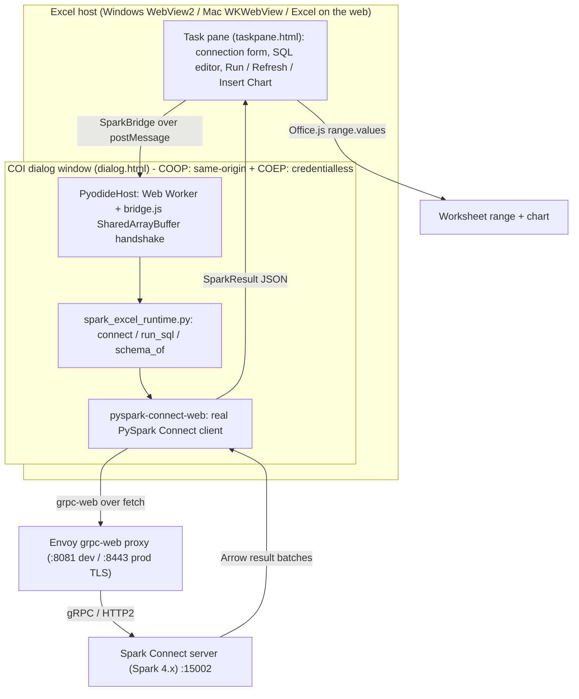

<!-- SPDX-License-Identifier: Apache-2.0 -->

# Architecture - spark-connect-excel

## Overview

spark-connect-excel is an Excel add-in that runs a Spark SQL query against the
user's own Spark Connect cluster, lands the result in a worksheet range, and
lets the user refresh it or chart it - with **no backend server of its own**.

The compute runs on the user's cluster; the query client runs in the browser via
[pyspark-connect-web](https://github.com/HyukjinKwon/pyspark-client-wasm)
(real PySpark Connect, in-browser via Pyodide). Excel is the last-mile renderer.

---

## Architecture diagram



---

## Key design decisions

### DECISIONS #1 - COI host is a separate Office Dialog window

`SharedArrayBuffer` (the backbone of pyspark-connect-web's blocking `.collect()`)
requires cross-origin isolation (`crossOriginIsolated === true`). The task-pane
iframe is embedded inside Excel's host process and we cannot reliably control
its COOP/COEP headers across Windows WebView2, Mac WKWebView, and Excel on the
web.

**Solution:** Pyodide + pyspark-connect-web run inside an **Office Dialog window**
opened via `Office.context.ui.displayDialogAsync()`. That window is a real
top-level browser window serving a page we control. We serve it with:

```
Cross-Origin-Opener-Policy: same-origin
Cross-Origin-Embedder-Policy: credentialless
```

giving us `crossOriginIsolated === true` without depending on Excel's embedding.
The task pane acts as the UI and the Office range-writer; the dialog hosts Spark.

### DECISIONS #2 - COEP is `credentialless`, not `require-corp`

`require-corp` would block Pyodide (loaded from jsDelivr CDN) and the
pyspark-connect-web wheel (loaded from PyPI CDN) because those CDN origins do
not send `Cross-Origin-Resource-Policy` headers. `credentialless` grants
cross-origin access to any resource that doesn't carry credentials (cookies/auth),
which covers CDN wheels. Chromium-based Office hosts (WebView2, Edge, Chrome)
fully support `credentialless`. CI asserts its presence.

### DECISIONS #3 - Reuse pyspark-connect-web; do not fork

The Python wheel is consumed from PyPI via `micropip.install()` inside Pyodide.
Only three small browser JS glue files are copied into `public/vendor/` (they
must be served same-origin): `worker_bootstrap.js`, `bridge.js`, and
`coi-serviceworker.js`. These are unedited copies from upstream. See `docs/reuse.md`.

### DECISIONS #6 - Bearer tokens never touch cells or document settings

Tokens live in `OfficeRuntime.storage` (roaming, opaque to the spreadsheet file)
or in an in-memory fallback. `Office.context.document.settings` stores only the
non-secret connection config (host, port, TLS flag). See `docs/security.md`.

### DECISIONS #7 - Task pane never imports Pyodide/pcw

All Python and Spark code runs in the dialog. The task pane is pure Office.js +
UI + the bridge client. This is enforced by TypeScript's `include` in
`tsconfig.json` (task-pane files don't share a TS path with runtime files).

### DECISIONS #8 - Marshalling in Python, parsing in TypeScript

The Python runtime returns a single JSON string shaped exactly like `SparkResult`.
TypeScript only `JSON.parse`s it. No ad-hoc type coercion straddles the boundary.

---

## Component inventory

| Module | Location | Lane | Role |
|--------|----------|------|------|
| Task pane HTML/TS | `src/taskpane/` | E | UI: connection, SQL editor, run/refresh/chart |
| Dialog HTML | `src/dialog/dialog.html` | B | COI host window page |
| COI helper | `src/dialog/coi.ts` | B | `ensureCrossOriginIsolated()` |
| Dialog host | `src/dialog/dialogHost.ts` | B | Boots runtime, dispatches bridge messages |
| Pyodide host | `src/runtime/pyodideHost.ts` | C | Web Worker + SAB bridge wiring |
| Run Python RPC | `src/runtime/runPython.ts` | C | pcw_run / pcw_result protocol |
| SparkBridgeHost | `src/bridge/sparkBridgeHost.ts` | D | Dialog-side SparkBridge impl |
| SparkBridgeClient | `src/bridge/sparkBridgeClient.ts` | D | Task-pane-side SparkBridge impl |
| Marshal helpers | `src/bridge/marshal.ts` | D | Parse JSON from Python runtime |
| Python runtime | `python/spark_excel_runtime.py` | D | connect / run_sql / schema_of |
| Range writer | `src/excel/rangeWriter.ts` | F | SparkResult -> worksheet range |
| Type formatter | `src/excel/typeFormat.ts` | F | Spark types -> Excel number formats |
| Binding | `src/excel/binding.ts` | G | Query->range persistence |
| Refresh | `src/excel/refresh.ts` | G | Re-run query, rewrite range |
| Charting | `src/excel/chart.ts` | H | inferChartType + insertChart |
| Connection store | `src/connection/connectionStore.ts` | I | URI builder, token handling |
| Connection form | `src/connection/connectionForm.ts` | I | DOM form helpers |
| Deploy stack | `deploy/` | I | Envoy + Spark Docker Compose |
| pcw vendor files | `public/vendor/` | integrator | worker_bootstrap, bridge, coi-sw |
| Seam (frozen) | `src/seam.ts` | integrator | SparkBridge interface + message types |

---

## Data flow: runSQL

```
User clicks "Run" in the task pane
  |
  v
queryPanel.ts calls bridge.runSQL(sql, rowCap)
  |  SparkBridgeClient
  v
encodeMessage({kind:"req", id, method:"runSQL", args:[sql, rowCap]})
  |  dialog.messageChild(str)  <--- Office Dialog channel
  v
dialogHost.ts receives the message
  |  SparkBridgeHost.runSQL(sql, rowCap)
  v
callPy("run_sql", sql, rowCap)  ->  RuntimeHost.runPython(snippet)
  |  postMessage({type:"pcw_run", src}) -> Web Worker
  v  (SAB + Atomics bridge; blocking in the worker)
spark_excel_runtime.run_sql(sql, rowCap)
  ->  spark.sql(sql).limit(rowCap+1).toPandas()
  ->  JSON string (SparkResult shape)
  v
worker postMessage({type:"pcw_result", result}) -> main thread
  |  runPython() promise resolves with the JSON string
  v
parseResult(json)  ->  SparkResult object
  |  encodeMessage({kind:"res", id, ok:true, result:sparkResult})
  |  Office.context.ui.messageParent(str)  <--- back to task pane
  v
SparkBridgeClient receives the response -> pending promise resolves
  |
  v
rangeWriter.writeResult(result, anchorRange)  ->  range.values, number formats
bindingStore.saveQueryBinding(q)  ->  document settings
```

---

## See also

- `DECISIONS.md` - all architectural invariants
- `API_CONTRACT.md` - the frozen SparkBridge seam
- `docs/security.md` - threat model and token handling
- `docs/reuse.md` - pyspark-connect-web provenance
- `docs/installation.md` - how to build, dev, and sideload
- `deploy/README.md` - Spark + Envoy stack
